  <h1 align="center"><strong>Bingo Twingo App</strong></h1>

## INDEX

  * Bingo Twingo App
  * Tecnologías Implicadas :
    * Javascript ES6
    * NodeJs
    * Express
    * Websockets:
         * Socket.io 
    * Webpack
    * GitHub Actions
    * Jest
    * ESLint
  * Proceso de Desarrollo

# Bingo Twingo App

 * Bingo twingo es un proyecto de desarrollo de aplicaciones web en modo offline y online _**usando websockets con socket.io**_ que consiste en un juego de bingo online tradicional para jugar sin conexión a internet o online con otros jugadores remotos.

 * Es rápido y divertido y no requiere ningún tipo de inicio de sesión, registrarse, joder, el infierno de las cookies ... y todas las cosas molestas que suelen tener las aplicaciones web modernas.

 * Ha sido desarrollado como una aplicación de una sola página con javascript RAW ES6. La única biblioteca de terceros utilizada en la interfaz ha sido socket_io_client.

    _**En backend _lado del servidor_ usamos nodejs + express + socket.io**_

# Tecnologías Implicadas

## Javascript ES6

* **JavaScript** es un lenguaje de programación o de secuencias de comandos que te permite implementar funciones complejas en páginas web.
* Cada vez que una página web hace algo más que sentarse allí y mostrar información estática para que la veas, muestra oportunas actualizaciones de contenido, mapas interactivos, animación de Gráficos 2D/3D, desplazamiento de máquinas reproductoras de vídeo, etc., puedes apostar que probablemente JavaScript está involucrado.
* _Es la tercera capa del pastel de las tecnologías web estándar, dos de las cuales **HTML y CSS** hemos cubierto con mucho más detalle en otras partes del Área de aprendizaje._

### Entonces, ¿qué puede hacer realmente?

* Almacenar valores útiles dentro de variables.
* Operaciones sobre fragmentos de texto _conocidas como "cadenas" (strings) en programación_.
* Y ejecuta código en respuesta a ciertos eventos que ocurren en una página web. Usamos un evento click en nuestro ejemplo anterior para detectar cuándo se hace clic en el botón y luego ejecutar el código que actualiza la etiqueta de texto.

    **¡Y mucho más!**

### Sin embargo, lo que aún es más emocionante es la funcionalidad construida sobre el lenguaje JavaScript de lado del cliente. Las denominadas interfaces de programación de aplicaciones (API) te proporcionan superpoderes adicionales para utilizar en tu código JavaScript.

### _Las API son conjuntos de bloques de construcción de código listos para usar que permiten a un desarrollador implementar programas que de otro modo serían difíciles o imposibles de implementar._

## Qué es ECMAScript

*  ECMAScript es el estándar que define cómo debe de ser el lenguaje Javascript. 
* Es poco aconsejable usar hoy ES6, debido a la falta de compatibilidad.Lo correcto sería esperar a que todos los navegadores se pongan al día para empezar a usar ES6 con todas las garantías.
* Afortunadamente,los transpiladores son programas capaces de traducir el código de un lenguaje para otro, o de una versión para otra. Por ejemplo, el código escrito en ES6, traducirlo a ES5. Dicho de otra manera, el código con posibles problemas de compatibilidad, hacerlo compatible con cualquier plataforma.

## NodeJs

* **NodeJs** es un entorno de tiempo de ejecución de JavaScript _de ahí su terminación en .js haciendo alusión al lenguaje JavaScript_.
* Este entorno de tiempo de ejecución en tiempo real incluye todo lo que se necesita para ejecutar un programa escrito en JavaScript. También aporta muchos beneficios y soluciona muchísimos problemas, por lo que sería más que interesante realizar nuestro curso de Node.js para obtener las bases, conceptos y habilidades necesarias que nos motiven a profundizar en sus opciones e iniciar la programación. 

* Fue creado por los desarrolladores originales de JavaScript.
* Gracias a Node.js se puede ir un paso más allá en la programación con JavaScript no solo creando sitios web interactivos, sino teniendo la capacidad de hacer cosas que otros lenguajes de secuencia de comandos como Python pueden crear. 

* **La idea principal de Node.js es usar el modelo de entrada y salida sin bloqueo y controlado por eventos para seguir siendo liviano y eficiente frente a las aplicaciones en tiempo real de uso de datos que se ejecutan en los dispositivos.**

## Express 

* **Express** es el framework web más popular de Node, y es la librería subyacente para un gran número de otros frameworks web de Node populares. Proporciona mecanismos para:

    * Escritura de manejadores de peticiones con diferentes verbos HTTP en diferentes caminos URL (rutas).
    *  Integración con motores de renderización de _'vistas'_ para generar respuestas mediante la introducción de datos en plantillas.
    *  Establecer ajustes de aplicaciones web como qué puerto usar para conectar, y la localización de las plantillas que se utilizan para renderizar   la respuesta.
    *   Añadir procesamiento de peticiones _'middleware'_ adicional en cualquier punto dentro de la tubería de manejo de la petición.

## WebSockets

* **WebSocket** es un protocolo de red basado en TCP que establece cómo deben intercambiarse datos entre redes. Puesto que es un protocolo fiable y eficiente, es utilizado por prácticamente todos los clientes. El protocolo TCP establece conexiones entre dos puntos finales de comunicación, llamados sockets. De esta manera, el intercambio de datos puede producirse en las dos direcciones.
* Se utiliza **WebSocket** siempre que se trate de establecer conexiones de forma rápida. Es el caso, por ejemplo, de los chats de asistencia técnica, de los tickers de noticias o de actualizaciones de bolsa en directo, de los servicios de mensajería instantánea y de los juegos en tiempo real.

## Socket.io

* **Socket.io** es una librería en JavaScript para Node.js que permite una comunicación bidireccional en tiempo real entre cliente y servidor. Para ello se basa principalmente en Websocket pero también puede usar otras alternativas como sockets de Adobe Flash, JSONP polling o long polling en AJAX, seleccionando la mejor alternativa para el cliente justo en tiempo de ejecución.

* _Es importante resaltar que las aplicaciones hechas en Socket.io tiene una desventaja y es que no soportan interacciones con otros clientes que usen Websocket estándar. Esto se debe a que Socket.io no es una implementación del protocolo Websocket sino una librería de comunicación web en tiempo real que utiliza varios protocolos._

## WebPack

* **WebPack** es básicamente un empaquetador de módulos o module bundler, pero gracias a un de sus componentes, los plugins, puede hacer las veces de tasks runner, es decir podemos hacer tareas de todo tipo, como mover directorios, hacer clean up, etc.
* Además , **Webpack** se define como un empaquetador de módulos.

* _En la actualidad es utilizado por miles de proyectos de desarrollo web Front-End: desde frameworks como React o Angular hasta en el desarrollo de aplicaciones tan conocidas como Twitter, Instagram, PayPal o la versión web de Whatsapp._

* También podemos definir **WebPack**,como una herramienta de compilación  que coloca en un grafo de dependencias a todos los elementos que forman parte de tu proyecto de desarrollo: código JavaScript, HTML, CSS, plantillas, imágenes, fuentes... Esta idea central es la que lo convierte en una herramienta tan poderosa.

##  GitHub Actions

* **GitHub Actions** permite crear flujos de trabajo **_workflows_** que se pueden utilizar para compilar, probar y desplegar código, dando la posibilidad de crear flujos de integración y despliegue continuo dentro del propio repositorio de git.
* Los flujos de trabajo tienen que contener al menos un _job_. Estos incluyen una serie de pasos que ejecutan tareas individuales que pueden ser acciones o comandos. Un flujo de trabajo puede comenzar por distintos eventos que suceden dentro de GitHub, como un _push_ al repositorio o un _pull_ request.

## Jest 

* **Jest** ha sido desarrollado por el equipo de Facebook y, aunque nace en el contexto de React, es un framework de testing generalista que podemos utilizar en cualquier situación.
* Con él que podemos construir tests unitarios trabajando con matchers personalizados, crear mocks o comprobar snapshots de componentes visuales como algo sencillo y accesible.

## ESLint

* Los linters son herramientas de programación que examinan el código del programador y lo ayudan a corregir errores de sintaxis, código incorrecto, malas prácticas o costumbres o incluso ayudarlo a seguir guías de estilo, favoreciendo escribir código de calidad y acostumbrando al usuario a solventar ciertos problemas comunes como programador.

*  **ESLint** es un linter que examina código Javascript, siguiendo unas ciertas normas y criterios personalizables por el programador, para que el código Javascript siga ciertos estándares y estilos, favoreciendo la escritura de código de calidad.
* **ESLint** es totalmente configurable y puedes indicarle que criterios _llamados reglas_ quieres que utilice y cuales prefieres que ignore, adaptándose a las necesidades de cualquier empresa, programador o equipo de trabajo.

# Proceso de Desarrollo

Esta práctica consistirá en aplicar una serie de mejoras sobre el proyecto de BingoTwingo , que consistirá en configurar un nuevo workflow dentro del proyecto denominado Bingo_Workflow. 
Dicho workflow sólo se ejecutará cuando se realice un push en la rama creada.

En primer lugar, el primer job que crearemos será el de verificación de sintaxis correcta que  se encargará de realizar la descarga del proyecto y de
verificar que la sintáxis utilizada és correcta en los ficheros javascript, para ello haremos lo siguiente : 

  * Primero en el codigo del bingo que ya teniamos, añadimos la pertinente carpeta .github, y dentro de esta la de workflows, donde estará ubicado el workflow con los jobs y steps pertinentes para dicha práctica.
  * Además para este job en concreto, en el cual utilizamos el **Eslint** he utilizado los archivos .eslintignore y .eslintrc.js.

  * .eslitignore
    * 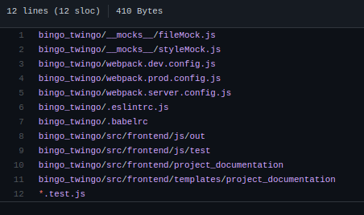
  * .eslintrc.js
    * 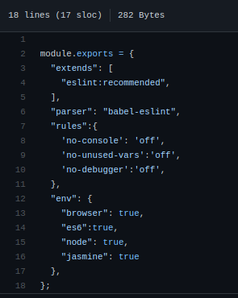

  * Y ya pasando al workflow quedaría de esta manera : 

      * 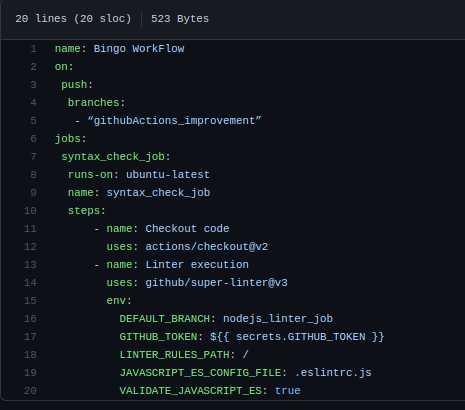
  
Como podeis observar en el workflow, el job se ejecutará al realizar un push en el rama,por lo tanto al hacer el push, nos dirigimos a github al repositorio y al apartado de actions y hay podremos comprobar como ha ido todo bien : 

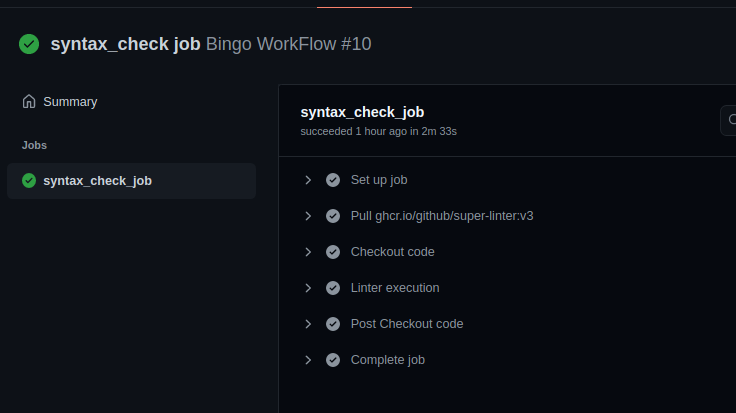

Y de esta manera el job , en primer lugar habrá descargado y el proyecto y en segundo y último habrá verificado que la sintáxis utilizada en la correcta.

Pasamos al segundo job , en el cual nos pide que un job se encarge de ejecutar y verificar los test que tenemos en el bingo, bien seguiremos estos pasos : 

* Como ya teniamos los test y las dependencias del jest en el proyecto del bingo, solo tuve que eliminar el directorio bingo_twingo donde tenia el bingo , y pasar todos los archivos de ese directori al dorectorio raiz para que el job pudiese ejecutar los test que previamente yo proba con el comando : `npm run test`.
* Además inclui en el .eslintignore las carpetas de la documentacion más algunas que no tiene que revisar la sintáxis.
* Seguidamente ya solo tuve que añadir el correspodiente job al workflow y realizar el git add . , git commit y el git push.
* Asi quedaría el workflow :

  * 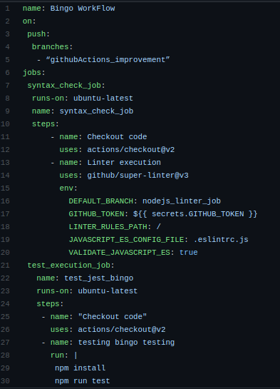
* Y comprobamos que haya ido todo bien el github : 

  * 
  * 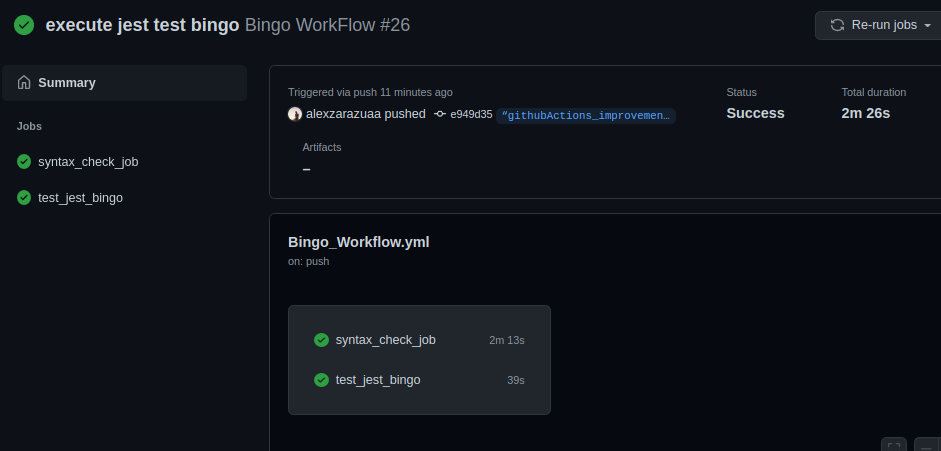

### _Los archivos de los test los podeis encontrar en el respositorio [aqui](https://github.com/alexzarazuaa/Bingo_JS/tree/%E2%80%9CgithubActions_improvement%E2%80%9D/src/frontend/js/test)_

### Pasamos al Job de generación de estáticos.

* Donde se nos pedía que el job realizara el proceso de compilado del proyecto y además  siempre y cuando hayan terminado los 2 jobs anteriores  y depositará los artefactos generados en la ruta build del projecto.

* _Los artifacts permiten compartir datos entre trabajos en un flujo de trabajo y almacenar datos una vez que ese flujo de trabajo se ha completado._

Lo que hize para esta parte , unicamente fue crear el job con el nombre que nos especifícan,además del step necesario con las siguientes actions : 

  * La primera que se encarga de comprobar el codigo
  * La segunda la cual realiza el build de la aplicación
  * Y la tercera que crea el artifact y lo deposita en la carpeta dist

_Sin olvidar el needs con los dos jobs anteriores que nos permitirá realizar este job siempre y cuando los anteriores se hayan ejecutado correctamente._

El job quedaria asi :

 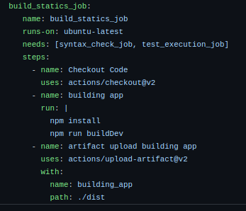

Como pasa en los anteriores se ejecuta al hacer un push en la rama , por lo tanto al hacer el push nos dirigimos a gihtub y comprobamos que los tres se hayan ejecutado correctamente :

* 

* 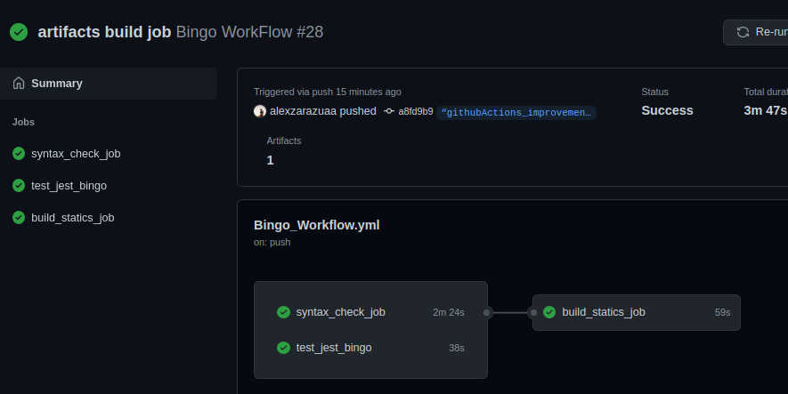

* 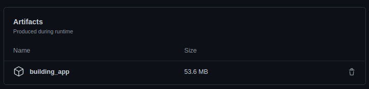

### Job de despliegue de los estáticos generados. 

Se nos pedia que  partiendo de los estáticos generados en el job anterior  desplegará el proyecto en surge.sh.

Para empezar  instalaremos la extensión de surge en el proyecto :  ` npm install -g surge '.

Luego nos dirigiremos a la carpeta dist desde el terminal y escrbiremos el comando ` surge ` , seguidamente si aun no lo hemos hecho nunca nos pedirá un correo, una contraseña y un nombre de dominio, en mi caso como ya lo hice para una practica anterior, el correo ya me salia , solo tuve que crear un nombre de dominio al cual puse : 'alexzarazua88.surge.sh'

  * 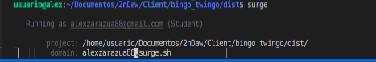

Además cree los correspondientes secrets de los token de surge en github,hacen falta dos tokens el surge login y el token de surge ,para saber el token simplemte con el comando ` sudo surge toke ` , nos mostrará por el teminal el nuestro surge token, y para el token de login será el correo que habremos configurado anteriormente en surge.

Nos dirigimos a github, y en settings en la barra lateral de la izquierda casi por el finla hay un apartado de secrets, entramos y habrá una pestaña de crear un nuevo secret, en referencia al del login, el nombre ponemos el que querramos y el valor será el correo, y con el token de surge lo mismo el nombre que creamos conveniente y como valor el token que nos mostró por termoinal al realizar el comando _sudo surge token_.

* 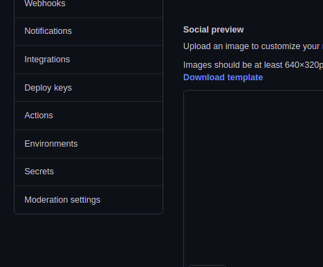

* 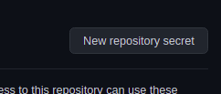

* 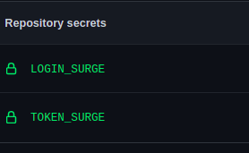

Una vez realizados estos pasos, procedemos ha realizar el correspodiente job en nuestro workflow,el cual estará compuesto por variso steps, uno para descargar el proyecto con la ayuda del artifact,y otro que hará el deploy del projecto en surge, además de los secrets creados en github:

* 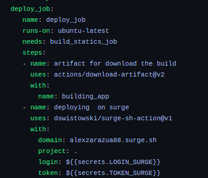

Para comprobar que todo ha ido bien, primero nos dirigimos a github para ver que el qorkflow se ha ejectuado correctamente y luego abrirmos una nueva pestaña en el navegador, escribimos nuestro dominio de surge y comprobarmos que se nos abre el proyecto:

* 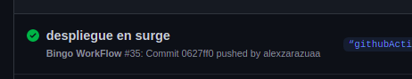

* 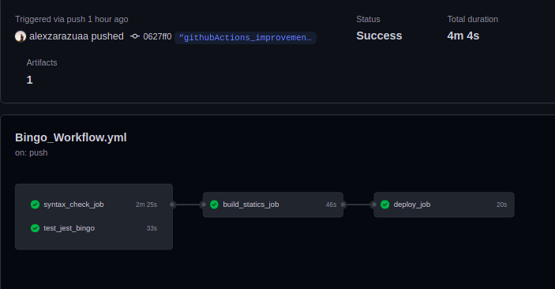

* 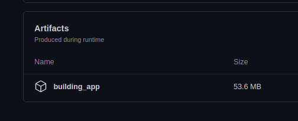

* 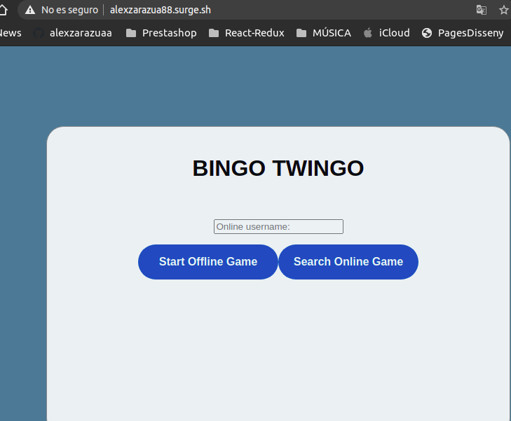

### Job de envío de notificación a los usuarios del proyecto.

Este job se encargará de enviar un correo con:
 *  **Destinatario**: dirección de correo vuestra personal tomada de un
secret de github
 *  **Asunto**: Resultado del workflow ejecutado
 *  **Cuerpo del mensaje** :
       * Se ha realizado un push en la rama githubActions_improvement que
      ha provocado la ejecución del workflow Bingo_Workflow con los
      siguientes resultados:
          * **syntax_check_job**: resultado asociada
          * **test_execution_job**: resultado asociada
          * **build_statics_job**: resultado asociada
          * **deploy_job**: resultado asociada

Bien, en primer lugar , lo que hize fue instalar la libreria nodemailer de npm, la cual utilizaremos para el envio del correo.
 * **Nodemailer** es un módulo para aplicaciones Node.js que permite el envío de correos electrónicos de forma sencilla.

 * La instalamos con el siguiente comando : ` npm install nodemailer ` .

 * 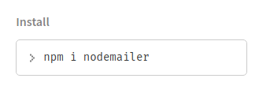

 En segundo lugar,crearemos una carpeta dentro del directorio .github , la cual se llamara actions y dentro de esta crearemos otro directorio en mi caso llamado *notification_job_email* y dentro de este será donde crearemos el actions.yml y un proyecto basico de nodeJs con un package.json creado gracias al comando `  npm init ` y un index.js.

 * 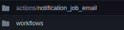
 * 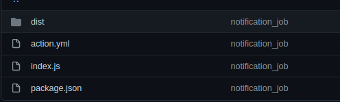

**_La carpeta Dist, la conseguimos al realizar el comando ` ncc build index.js, y este comando lo realizamos siempre y cuando tengamos un nuevo cambio en el index.js_**

Además me cree un nuevo correo de gmail que se encargará de enviar los correo por medio de nodemailer,en el gmail de este correo active dos opciones, la de : _permitir que aplicaciones poco seguras accedan a tu cuenta_ y el _IMAP_.

También utilizaremos los secrets de github , en este caso para almacenar el correo que enviará el mail , su contraseña, y el mail el cual recibiria los correos .

* 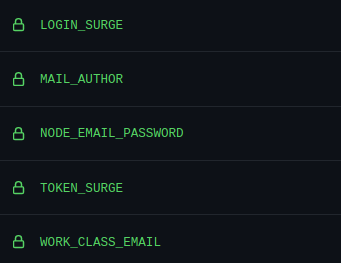

